# 光固化技术探索
## 目录

## 3D格式
### TODO LIST
- [ ] CAD组装件如何正确处理成stl格式
- [ ] fbx、obj可活动组装件如何正确处理stl格式
- [ ] glTF和fbx中的骨骼体处理方式
- [ ] step格式转换为stl格式之后如何处理精度下降的问题（如何控制精度）
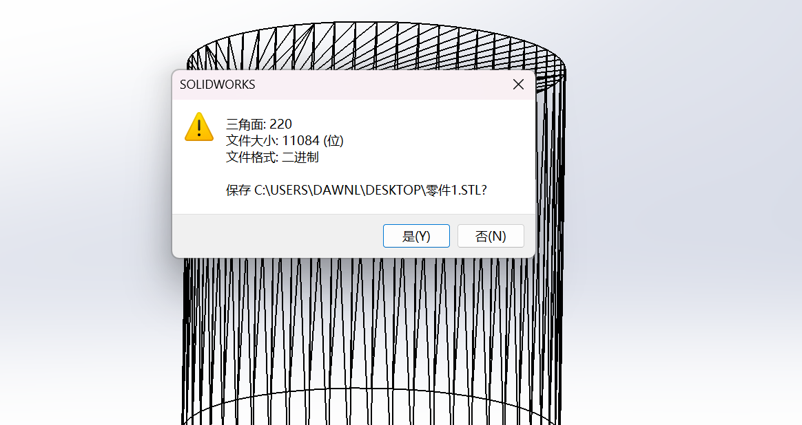
### 参考文献
https://blog.csdn.net/xufeng0991/article/details/139849242
### OBJ
使用顶点、纹理坐标、法线和面表示3D模型的简单文本数据格式  
* **构成:**  
  - 顶点（v）：定义3D空间中的点位置。  
  - 纹理坐标（vt）：用于2D纹理映射。  
  - 法线（vn）：定义面朝向，用于光照计算。  
  - 面（f）：通过顶点索引定义多边形的连接，支持三角形和四边形。  
* **应用领域：**   
    - 虚拟渲染领域：游戏、动画
    - 计算机视觉：物体识别、重建
  
* **立方体的OBJ文件示例：**  
```obj
# 顶点坐标    
v -1.0 -1.0 -1.0  
v  1.0 -1.0 -1.0  
v  1.0  1.0 -1.0  
v -1.0  1.0 -1.0  
v -1.0 -1.0  1.0  
v  1.0 -1.0  1.0  
v  1.0  1.0  1.0  
v -1.0  1.0  1.0  

# 法线  
vn 0.0 0.0 -1.0  
vn 0.0 0.0  1.0  
vn 1.0 0.0 0.0  
vn -1.0 0.0 0.0  
vn 0.0 1.0 0.0  
vn 0.0 -1.0 0.0  

# 面定义（每个面由三个顶点和对应的法线索引组成）  
f 1//1 2//1 3//1   
f 1//1 3//1 4//1  
f 5//2 6//2 7//2  
f 5//2 7//2 8//2  
f 1//3 5//3 8//3  
f 1//3 8//3 4//3  
f 2//4 6//4 5//4  
f 2//4 5//4 1//4  
f 3//5 7//5 6//5  
f 3//5 6//5 2//5  
f 4//6 8//6 7//6  
f 4//6 7//6 3//6  
```
* 优缺点分析
  * 优点：
    * 简单易读，使用纯文本格式。
    * 广泛支持，多种3D软件和渲染引擎都兼容。
    * 易于编辑和调试。
  * 缺点：
    * 不支持复杂的材质和动画信息。
    * 文件可能较大，尤其是包含大量顶点和面时。
    * 不支持层次结构和装配信息
      * 编码缺陷：由于其主要是基于文本的，主要关注顶点、面和材质所以不具备描述复杂层次关系或子模型的机制。
      * 设计目的：OBJ文件通常用于静态模型的表示，而非动态场景或动画，因此不需要记录复杂的装配信息。
* **在blender中创建obj模型并导出**
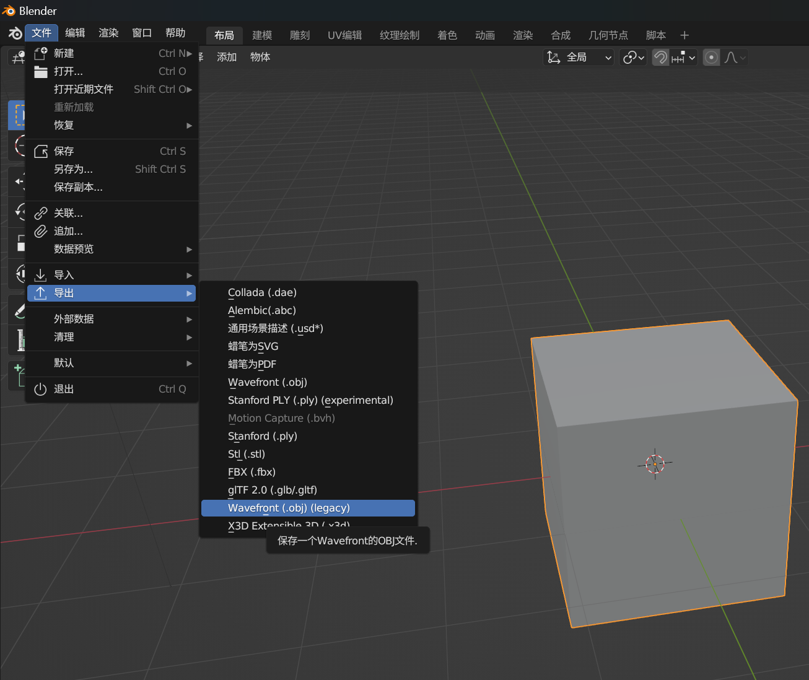 
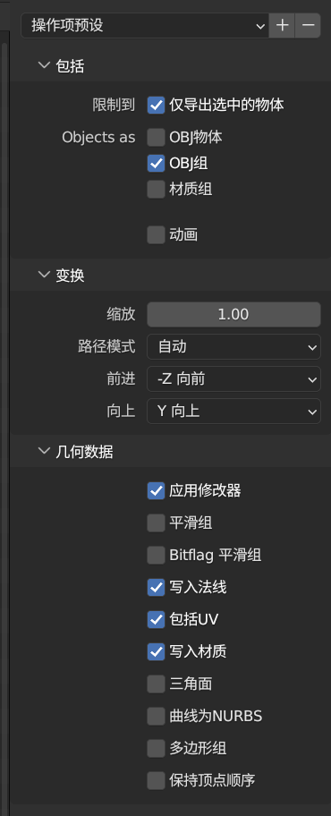
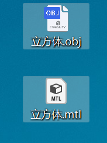  
导出的文件
### 补充：MTL材质文件
* **构成**
  * newmtl：定义新材质名称。
  * Ka：环境光颜色（RGB）。
  * Kd：漫反射颜色（RGB）。
  * Ks：镜面反射颜色（RGB）。
  * Ns：镜面光泽度（控制高光的锐利程度）。
  * d 或 Tr：材质的透明度（d为不透明度，Tr为透明度）。
  * illum：光照模型（如0为无光照，2为环境光和漫反射，3为环境光、漫反射和镜面反射等）。
  * map_Ka：环境光纹理图像。
  * map_Kd：漫反射纹理图像。
  * map_Ks：镜面反射纹理图像。
  * map_d：透明纹理图像。
  * bump：法线贴图或凹凸贴图。
* **材质文件示例**
```
newmtl Material1
Ka 0.2 0.2 0.2      # 环境光颜色（灰色）
Kd 0.8 0.8 0.8      # 漫反射颜色（亮灰色）
Ks 1.0 1.0 1.0      # 镜面反射颜色（白色）
Ns 100.0            # 光泽度
map_Kd texture.jpg  # 漫反射纹理图像
```
得到material.mtl文件
* 在OBJ文件中，添加以下行以引用材质文件
```
mtllib material.mtl  # 引用MTL文件
usemtl Material1     # 使用指定的材质
```
### glTF格式  
一种快速、可压缩的格式，使用JSON(.gltf)或二进制格式（.glb）编码  
* **构成**（glTF2.0）
  * Asset：描述文件的元数据，如版本、生成器等。
  * Scenes：描述3D场景的列表，每个场景包含一组节点（Node）。
  * Nodes：描述3D对象的列表，每个节点可以包含网格（Mesh）、摄像机（Camera）、骨骼（Skin）等。
  * Meshes：描述3D网格的列表，每个网格包含一组图元（Primitive）。Primitive 组成部分
  * attributes：一个对象，定义了与图元相关的顶点属性，比如位置（POSITION）、法线（NORMAL）、纹理坐标（TEXCOORD_0）等。
  * indices：一个索引缓冲区的索引，指向顶点数组中的索引，用于定义图元的几何形状。
  * material：一个材质的索引，用于定义图元的外观属性，如颜色、纹理等。
  * mode：一个整数，定义了图元的绘制模式，比如点、线、三角形（默认值）等。常见的值包括：
    * POINTS 独立的点（1个点）
    * LINES 线段（2个顶点）
    * LINE_LOOP 线环（首尾相连的点）
    * LINE_STRIP 线条带（顶点按顺序连接成线段）
    * TRIANGLES 三角形（3个顶点）
    * TRIANGLE_STRIP 三角形带（每个顶点与前两个顶点形成三角形）
    * TRIANGLE_FAN 三角形扇（第一个顶点作为扇的中心，后续的每两个顶点与中心顶点形成一个新的三角形）
  * Materials：描述材质的列表，每个材质定义了表面的外观，如颜色、纹理、光照模型等。
  * Textures：描述纹理的列表，每个纹理包含一个图像（Image）和一个采样器（Sampler）。
  * Animations：描述动画的列表，每个动画包含一组通道（Channel）和采样器（Sampler）。

* **应用领域：**   
    - 虚拟渲染领域：游戏（在游戏引擎中实现高效的资产加载）、动画、交互、展示
* **glTF文件示例：**  
```glTF
{
  "asset": {
    "version": "2.0"
  },
  "scenes": [
    {
      "nodes": [0]
    }
  ],
  "nodes": [
    {
      "mesh": 0
    }
  ],
  "meshes": [
    {
      "primitives": [
        {
          "attributes": {
            "POSITION": 0
          },
          "indices": 1
        }
      ]
    }
  ],
  "buffers": [
    {
      "uri": "data:application/octet-stream;base64,...",
      "byteLength": 1024
    }
  ],
  "bufferViews": [
    {
      "buffer": 0,
      "byteOffset": 0,
      "byteLength": 512
    }
  ],
  "accessors": [
    {
      "bufferView": 0,
      "componentType": 5123,
      "count": 36,
      "type": "SCALAR"
    }
  ]
}

```
* **在blender中创建gltf模型并导出**
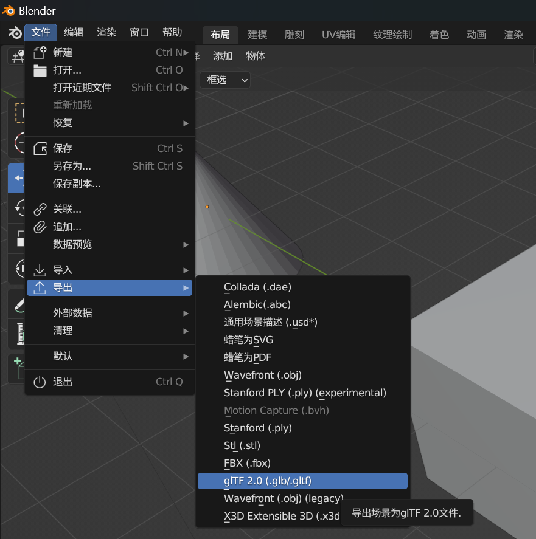
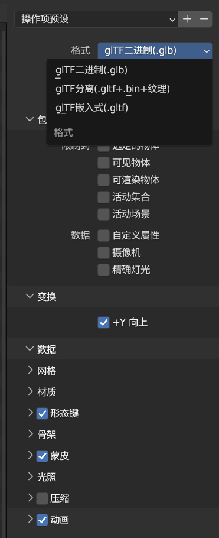
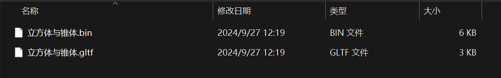
glTF（GL Transmission Format）格式，作为一个用于3D模型和场景的传输标凈，具有许多优点，但也存在一些局限性。下面我将详细介绍这些优缺点：

**优点**

1. **高效性**：glTF格式设计用来快速加载，优化了文件大小和运行时处理，使其成为Web和移动应用中理想的3D内容格式。
   
2. **易于使用**：glTF格式相对简单，支持现代Web技术，易于与多种3D编辑工具和图形库集成，如Three.js、Babylon.js等。

3. **实时渲染优化**：支持PBR（Physically-Based Rendering）材质，这意味着模型在各种照明环境下都能呈现出真实和一致的视觉效果。

4. **压缩支持**：glTF支持二进制文件格式（GLB），可以将纹理和模型数据打包在一个文件中，进一步减小文件体积和提高加载速度。

5. **扩展性**：glTF标准支持通过扩展来增加新功能，例如微软的清晰度压缩纹理（MSFT_texture_dds）、谷歌的Draco几何压缩等。

6. **全面性**：支持动画、皮肤、骨骼和摄像机等复杂功能，适用于需求广泛的应用场景。

**缺点**

1. **复杂性管理**：尽管glTF旨在简化3D内容的交付，但其PBR材质和高级动画特性的设置可能对初学者来说较为复杂。

2. **编辑器和工具的支持度不一**：虽然大多数主流3D工具都支持导入导出glTF格式，但一些特定的工具可能在细节上存在兼容性问题，特别是在高级特性如复杂动画和自定义着色器方面。

3. **性能要求**：使用高级PBR材质和复杂的模型结构可能对渲染性能提出较高要求，尤其是在低端设备上。

4. **标准化更新和扩展**：虽然扩展性为glTF带来了灵活性，但也可能导致标准化的碎片化，不同的实现可能需要特定的扩展才能实现预期效果。

5. **全面性带来的负担**：支持广泛的功能可能使得简单应用的开发和维护变得不必要地复杂。

总体来说，glTF是一种非常强大的3D模型格式，适合于需要快速、高效加载3D内容的现代应用。尽管存在一些挑战，它的设计和支持的特性使其成为当前最受欢迎的3D传输格式之一。如果你需要更详细的技术指导或应用建议，请随时提问。
### STEP格式   
ISO 10303，交换数字产品信息的国际标准文件格式。
* **构成**
  * 几何数据：包括点、线、曲面和体。
  * 拓扑数据：描述几何元素之间的关系，如面如何连接成一个实体。
  * 元数据：提供模型的更多信息，如材料属性、颜色、作者和版权信息。
  * 装配信息：详细描述了组件如何组装在一起，包括约束和装配顺序。
* **应用协议（这类标准协议均需要付费查看）**
  * **AP203 (Configuration Controlled Design)**  
AP203 是最常用于机械设计和CAD数据交换的协议之一，支持从CAD系统到制造系统的数据转移。虽然它主要关注的是设计数据的配置管理，但这些数据也可以用于支持3D打印和零件制造。
  * **AP242 (Managed Model Based 3D Engineering)**
AP242 是集成了AP203和AP214（Automotive Design）的特性，旨在成为制造业中的统一标准。它支持产品生命周期管理（PLM）的多个方面，包括模型的制造信息，特别适用于包含了3D打印在内的高级制造技术。AP242 提供了关于制造特征、材料属性和其他对于3D打印至关重要的信息。
  * **AP224 (Mechanical Product Definition for Process Planning)**
AP224 专门针对制造过程规划，包括特定的制造特征，如孔、槽、凸台等。虽然这主要用于传统制造，但也可以应用于3D打印零件的设计和规划，尤其是在复杂零件的准备阶段。  
ISO网址：https://www.iso.org/search.html
* **STEP文件示例（概念性）**
```step
ISO-10303-21;
HEADER;
FILE_DESCRIPTION(('A simple STEP file example with a plate and a hole'),
'2;1');
FILE_NAME('example','2023-09-27T12:00:00',('Author Name'),('Organization'),
'Preprocessor Version 1.0','STEP AP203','none');
FILE_SCHEMA(('AUTOMOTIVE_DESIGN { 1 2 10303 203 11 1 1 }'));
ENDSEC;

DATA;
#1 = PRODUCT('1234','Plate','A simple plate with a hole',(#5));
#2 = PRODUCT_DEFINITION('part',#1,#3);
#3 = PRODUCT_DEFINITION_FORMATION_WITH_SPECIFIED_SOURCE('any',#1,.MADE.);
#4 = PRODUCT_RELATED_PRODUCT_CATEGORY('part',$,(#1));
#5 = PERSON_AND_ADDRESS($,$,$,('Author Name'),$,$,$,$);
#6 = SHAPE_DEFINITION_REPRESENTATION(#7,#10);
#7 = PRODUCT_DEFINITION_SHAPE('',$,#2);
#8 = AXIS2_PLACEMENT_3D('Standard',#15,#16,#17);
#9 = CIRCLE('Edge',#8,5.0);
#10 = ADVANCED_BREP_SHAPE_REPRESENTATION('Plate with hole',(#11,#12),#13);
#11 = PLANE('Top Surface',#14);
#12 = EXTRUDED_AREA_SOLID('Plate body',#11,#9,10.0);
#13 = GEOMETRIC_REPRESENTATION_CONTEXT(3);
#14 = AXIS2_PLACEMENT_3D('Top Surface Placement',$,#15,#16);
#15 = CARTESIAN_POINT('Center', (0.0, 0.0, 0.0));
#16 = DIRECTION('Z', (0,0,1));
#17 = DIRECTION('X', (1,0,0));

ENDSEC;
END-ISO-10303-21;
```
* **在solidworks中创建并导出step格式的文件**
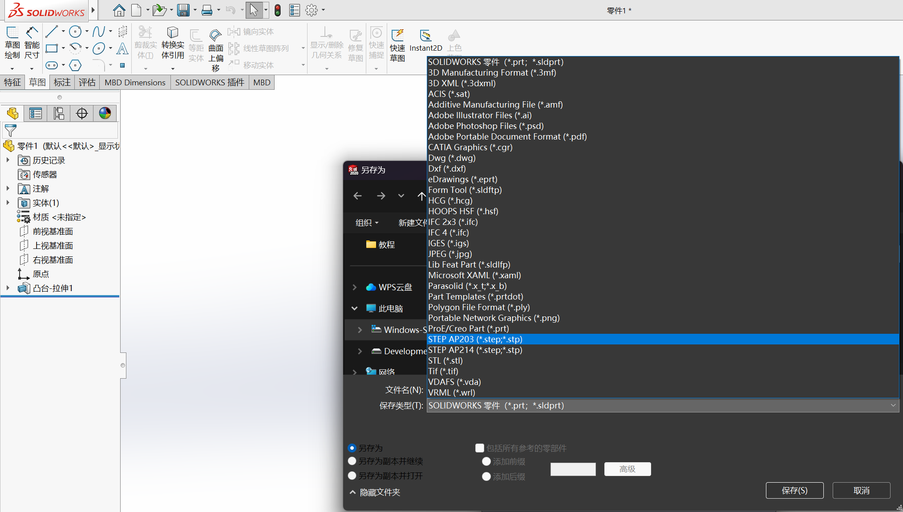
### fbx模型
可以存储纹理、材质、骨骼、动画数据、灯光、相机等数据的功能强大且全面的3D资产传输格式。
FBX文件可以使用二进制格式或ASCII文本格式来表示数据。
* **构成**
  * **文件头（Header）**
    * 文件版本：FBX文件的最前面通常会标注FBX格式的版本号，例如“FBX 7.4.0”代表FBX 2014版本。这部分信息帮助软件识别文件的版本，以确保兼容性。
    * 文件信息：这部分包含一些元数据，如创建时间、创建软件、导出的软件版本等。
  * **根节点（Root Node）**  
  FBX文件的所有数据都包含在根节点下，根节点是一个容器，用来存储场景中的所有其他节点。
  * **对象节点（Objects）**
    * 几何体（Geometry）：每个几何体都是一个节点，描述了网格的顶点、面、法线、UV坐标等信息。几何体通常包含以下子节点：
    * Vertices（顶点）：存储顶点位置的数组。
    * Polygon Vertex Indices（多边形顶点索引）：定义多边形面是如何连接顶点的。
    * Normals（法线）：存储法线的方向，用于照明计算。
    * UVs（UV坐标）：用于纹理映射的坐标。
    * 材质（Materials）：材质信息节点保存了材质的属性，如颜色、反射率、透明度等。材质节点还会引用纹理文件。
    * 纹理（Textures）：每个纹理节点保存图像纹理文件的引用，并指定纹理的类型（如漫反射、法线等）。它们可以与材质相关联。
  * **模型节点（Model）**  
  这是一个非常重要的节点，用来定义场景中具体的对象。每个对象（如几何体、灯光、相机、骨骼等）都会有一个对应的模型节点。模型节点包括以下信息：
  变换矩阵（Transformation Matrix）：保存物体的位移、旋转和缩放信息，用来定义物体在3D空间中的位置和方向。
  层次关系（Parent-Child Relationship）：模型节点可以互相嵌套，形成父子层次结构，例如骨骼的层级关系。
  * **连接节点（Connections）**  
  连接节点定义了对象之间的关系。例如，几何体和材质如何连接、骨骼如何绑定到几何体、动画如何影响对象等。这些连接用节点ID来表示，例如一个几何体可能与一个材质通过其ID连接。
  * **动画节点（Animation）**  
  如果FBX文件包含动画数据，动画节点将包含动画曲线和关键帧信息。FBX的动画部分分为以下几个子节点：
  动画曲线（Animation Curve）：每个动画曲线定义了对象属性（如位置、旋转、缩放等）随时间的变化。
  关键帧（Keyframe）：定义在某个时间点对象的属性值。
  动画层（Animation Layer）：支持多层动画，可以定义不同的动画层来覆盖或混合不同的动画效果。
  * **骨骼节点（Skeleton）**  
  FBX文件支持复杂的角色绑定（Rigging），骨骼节点定义了骨架结构，每个骨骼都是一个模型节点的子节点。骨骼节点包括以下信息：
  骨骼层级结构：骨骼通常按照层级结构组织，类似于身体的骨骼系统。
  蒙皮权重（Skin Weights）：存储了几何体顶点如何受骨骼影响的权重值，这决定了顶点在动画中的变形方式。
  * **灯光和相机节点（Lights and Cameras）**  
    * 灯光节点（Light Node）：定义场景中的光源，包含光源的类型（如点光源、聚光灯）、光照颜色、光照强度等参数。
    * 相机节点（Camera Node）：定义场景中的相机，包含相机的视角、焦距、位置等属性。
  * **材质与纹理（Materials and Textures）**  
  材质节点保存了对象的表面外观信息，包括颜色、反射率、透明度等。每个材质可以链接多个纹理节点，用于指定材质的纹理贴图。
  纹理节点包含纹理的文件路径、UV坐标和纹理的类型（如漫反射贴图、法线贴图等）。
    * 10. 拓扑与变形节点（Deformers）  
  Deformers节点用来定义顶点的变形方式，通常用于角色的蒙皮和变形动画。它包括骨骼变形和混合变形（Blend Shapes）等功能。
    * 11. 层次和场景管理
  Layer（层）：FBX文件可以将场景中的对象组织成不同的层，以方便管理和编辑。例如，一个场景可能有几何层、动画层、灯光层等。
  场景层级（Scene Hierarchy）：每个对象都可以根据父子关系嵌套在其他对象下，形成完整的场景树结构。这种层次结构帮助管理复杂的场景。
    * 12. 其他辅助数据
  全局设置（Global Settings）：这部分包含了一些场景的全局设置，例如单位（米、厘米）、帧速率等。
  嵌入的媒体文件：FBX文件有时会嵌入纹理、音频等媒体文件，用于确保场景完整性。
* **文件示例（概念性）**
```fbx
FBXHeaderExtension
  |- FBXVersion: 7400
  |- CreationTime: "2023-10-08"

Objects
  |- Model: "Cube" (ID=1)
    |- Vertices: [x1, y1, z1, ...]
    |- PolygonVertexIndex: [0, 1, 2, -1, ...]
    |- Materials: "RedMaterial" (ID=100)
    |- Parent: "Root"

  |- Material: "RedMaterial" (ID=100)
    |- DiffuseColor: (1, 0, 0)
    |- Texture: "RedTexture" (ID=200)
    
  |- Texture: "RedTexture" (ID=200)
    |- FileName: "red.png"

Connections
  |- Connect: Model (ID=1) to Material (ID=100)
  |- Connect: Material (ID=100) to Texture (ID=200)


```
* **在blender中创建fbx格式并进行导出**
  *  创建一个简单的3D帧动画 
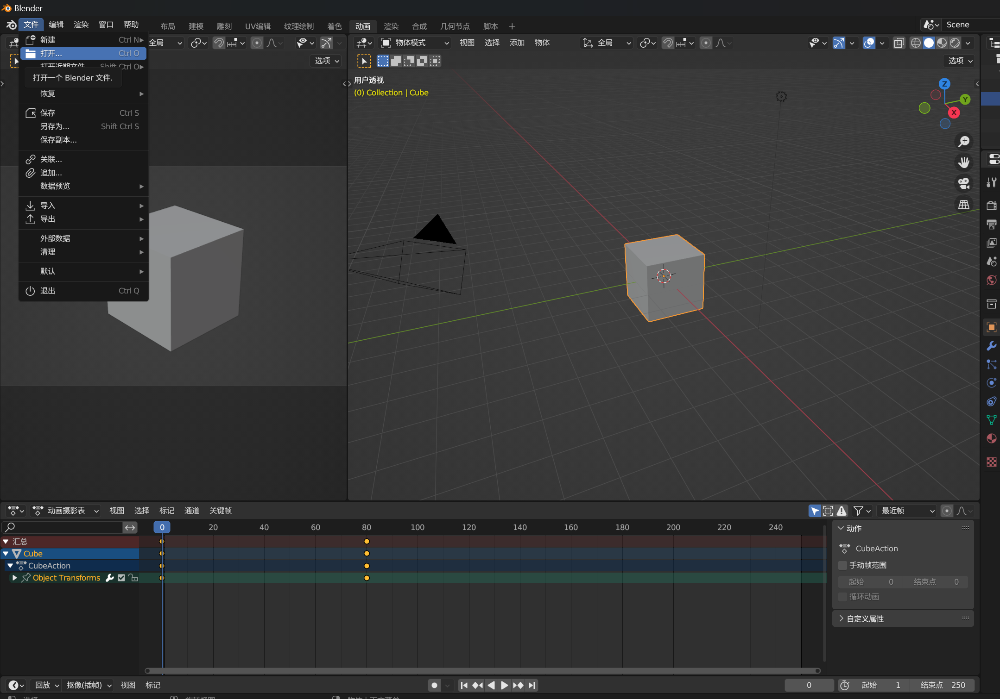
  * fbx的导出选项
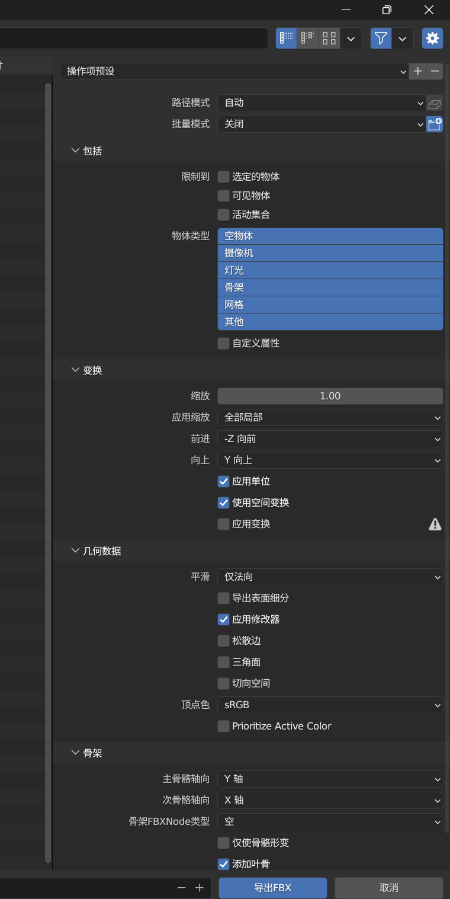
### stl格式*
专门用于表示三维模型的表面几何的格式，不包含颜色、纹理或其他如材质、光源等信息。可以用ASCII格式和二进制格式进行表示。
**STL文件是3D打印领域的标准格式，所有主流的3D打印机和切片软件都支持STL格式。**
* **构成（ASCII）**：STL文件主要由一系列三角形面片组成，每个面片包括法线和三个顶点。
  * solid 和 endsolid：标记STL文件的开始和结束，name_of_the_model是模型名称。
  * facet normal：定义三角形面片的法线向量（nx, ny, nz）。
  * vertex：定义三角形的三个顶点，每个顶点有三个坐标（x, y, z）。
  * outer loop 和 endloop：标识三角形顶点的循环，实际数据为三个顶点的坐标。
* **示例**
```stl
solid cube
  facet normal 0 0 1
    outer loop
      vertex 0 0 0
      vertex 1 0 0
      vertex 1 1 0
    endloop
  endfacet
  facet normal 0 0 1
    outer loop
      vertex 0 0 0
      vertex 1 1 0
      vertex 0 1 0
    endloop
  endfacet
endsolid cube
```
* **模型转换**
* step模型转换为stl文件
  * SolidWorks转换方式：直接导入，选择另存为进行转换【Tips：该转换方式无法控制精度】 
  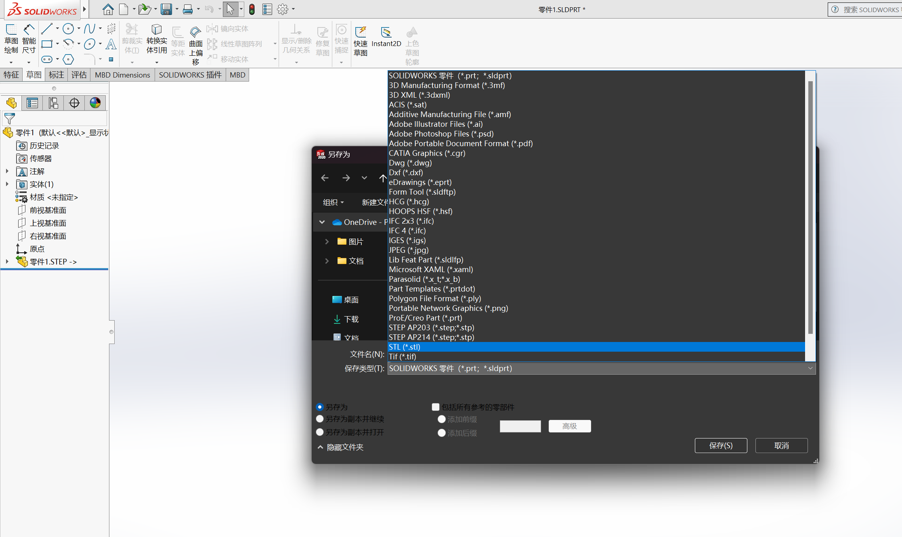
    * blender无法直接处理step格式的文件
  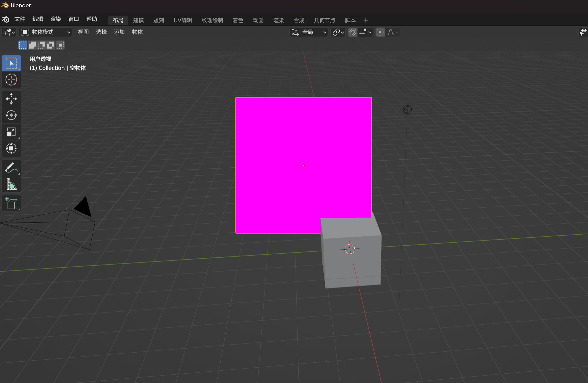
* obj模型转换为stl文件
  * 在blender中先导入obj格式的文件、再导出
  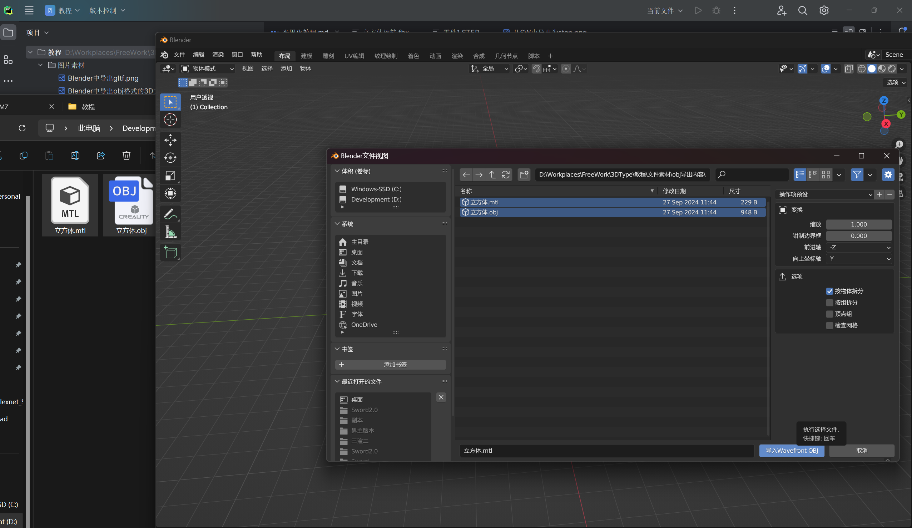
  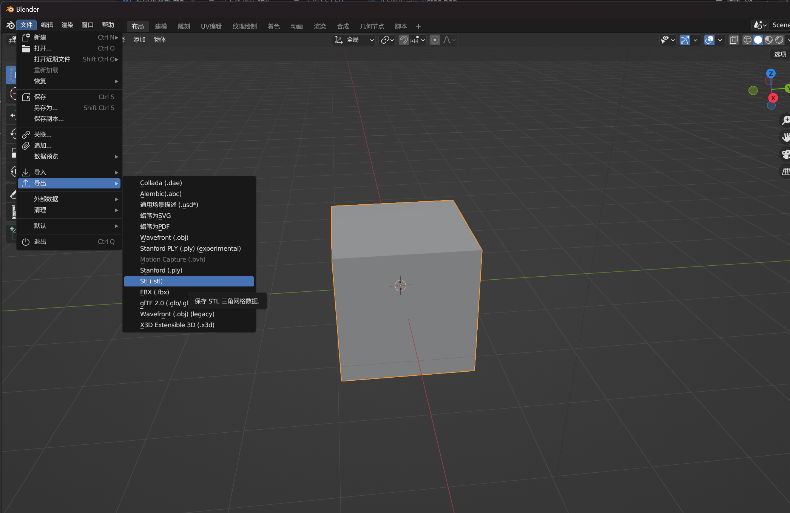
  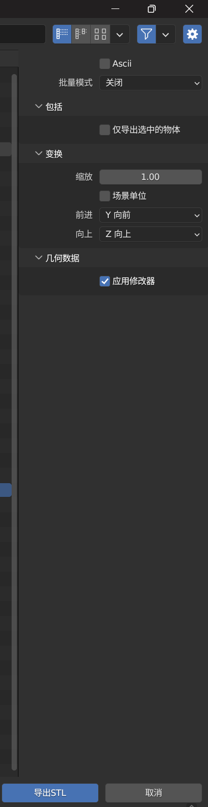
* glTF转换为stl文件
  * 导入Blender，操作同obj，如遇到场景组，请勾选仅导出选中的物体
    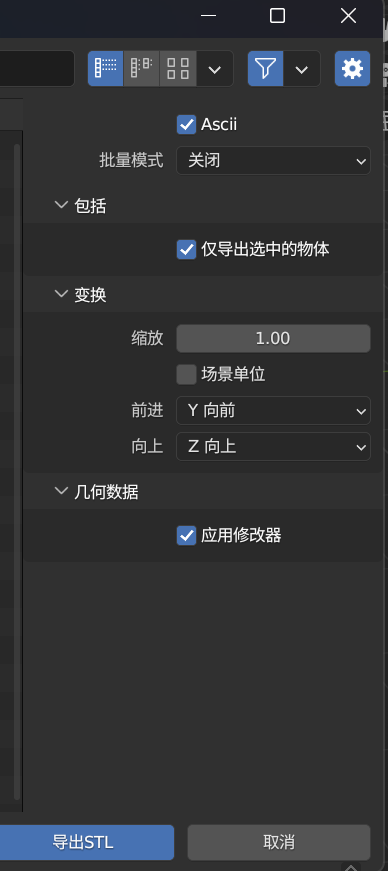
* fbx转换为stl文件
  * 导入Blender，操作同obj，因为fbx格式通常有动画，会出现下方的时间轴，时间轴定格的时间点的模型变换即为stl导出的模型变换
    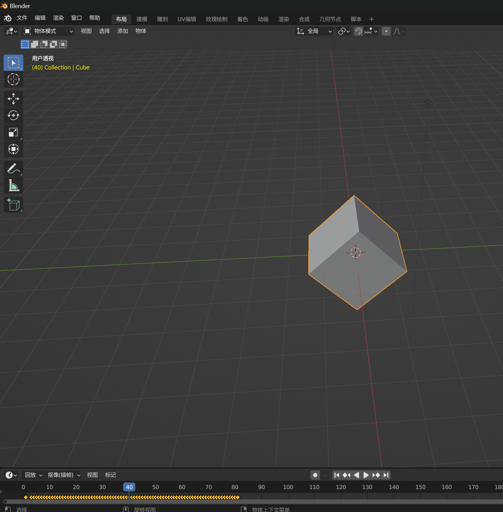
    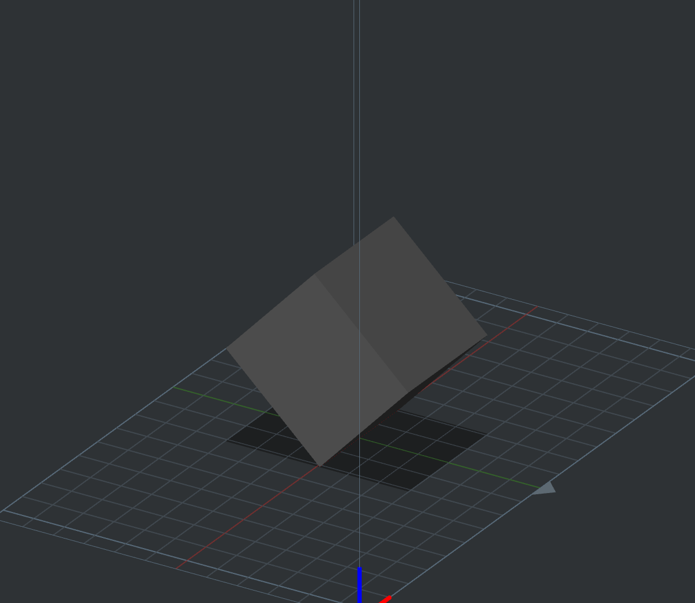
## 切片格式
